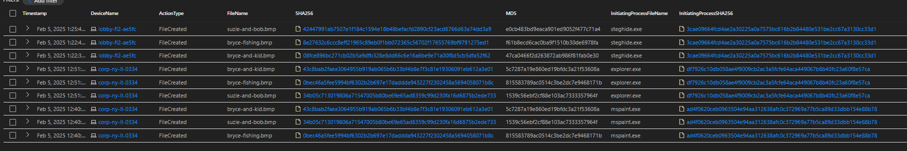

# Threat Hunting Case Study: Insider Data Exfiltration via Steganography

## Overview
In this case study, I conducted a full behavioral threat hunt using Microsoft Defender for Endpoint and KQL to identify and investigate a simulated insider threat. The actor (user: `bmontgomery`) accessed sensitive documents, embedded them into BMP images using `steghide.exe`, and compressed them into a ZIP archive for exfiltration. The hunt exposed the entire attack chain, from initial access to final exfiltration.

---

## Objective
- Identify unauthorized document access
- Detect data obfuscation via steganography
- Uncover data compression and exfiltration methods
- Correlate activities across multiple systems using file hashes and behavioral data

---

## Investigation Timeline & KQL Queries

### Step 1: Identify Accessed Corporate Documents
```kql
DeviceFileEvents
| where DeviceName == "corp-ny-it-0334"
| where InitiatingProcessAccountName == "bmontgomery"
| where FileName endswith ".pdf" or FileName endswith ".docx" or FileName endswith ".xlsx"
| order by Timestamp asc
| project Timestamp, FileName, FolderPath, SHA256, MD5
```
➡️ Revealed sensitive documents accessed by the user.


### Step 2: Track Files via Hash Across Devices
```kql
DeviceFileEvents
| where SHA256 in (
    "ec727a15bf51e027b9a1bbf097cfa9d57e46aa159bfa37f68dca5e3c5df5af3d",
    "657c41d860ce131c3a1d397a5fcd405d4e71b404ce10b775a1b8359763551c3b",
    "3d21356bcf39032d2bb6e772bdfd131f754bb66d8b8f404e4de0ee4a8f6142c8"
)
| order by Timestamp asc
| project Timestamp, DeviceName, InitiatingProcessAccountName, FileName, FolderPath, SHA256
```
➡️ Found the same files accessed under new names on another device.


### Step 3: Pivot to File Names (Obfuscated)
```kql
DeviceEvents
| where FileName in ("bryce-homework-fall-2024.pdf", "Amazon-Order-123456789-Invoice.pdf", "temp__2bbf98cf.pdf")
| order by Timestamp desc
```
➡️ Led to the discovery of `steghide.exe` activity.

### Step 4: Detect Use of Steganography Tools
```kql
DeviceProcessEvents
| where ProcessCommandLine contains "steghide.exe"
| project Timestamp, DeviceName, ProcessCommandLine, InitiatingProcessFileName, FolderPath
| order by Timestamp desc
```
➡️ Identified suspicious processes interacting with BMP files.


### Step 5: Review BMP Image Files Used
```kql
DeviceFileEvents
| where FileName in ("suzie-and-bob.bmp", "bryce-and-kid.bmp", "bryce-fishing.bmp")
| project Timestamp, DeviceName, ActionType, FileName, SHA256, MD5, InitiatingProcessFileName, InitiatingProcessSHA256
| order by Timestamp desc
```
➡️ Confirmed files used for steganographic embedding.



### Step 6: Find Compression Activity (7-Zip)
```kql
DeviceProcessEvents
| where DeviceName == "lobby-fl2-ae5fc"
| where ProcessCommandLine has_any ("bryce-and-kid.bmp", "bryce-fishing.bmp", "suzie-and-bob.bmp")
| where FileName == "7z.exe"
| project Timestamp, DeviceName, FileName, ProcessCommandLine
| order by Timestamp desc
```
➡️ Revealed creation of archive: `secure_files.zip`


### Step 7: Track ZIP File Movement
```kql
DeviceFileEvents
| where DeviceName == "lobby-fl2-ae5fc"
| where FileName == "secure_files.zip"
| order by Timestamp desc
```
➡️ Located and logged the ZIP file creation.


### Step 8: Hash-Based Tracking of Final ZIP File
```kql
DeviceFileEvents
| where SHA256 == "07236346de27a608698b9e1ffef07b1987aa7fe8473aac171e66048ff322e2d6"
| order by Timestamp desc
```
➡️ Detected file rename on original user's machine — smoking gun.


### Step 9: Confirmed Final Filename Change
```kql
DeviceFileEvents
| where FileName == "marketing_misc.zip"
| order by Timestamp desc
```
➡️ Verified file was renamed to obscure its origin.

---

## Artifacts & Evidence
- SHA256 hashes of involved documents and final archive
- Process command lines showing use of `steghide.exe` and `7z.exe`
- File rename events and movement across machines
- BMP files containing hidden data

---

## Lessons Learned
- Behavioral-based threat hunting provides valuable insight into stealthy insider activity
- Hash tracking remains a powerful pivot point across devices and filenames
- Obfuscation via steganography is a legitimate tactic in real-world data exfiltration
- Endpoint visibility and EDR telemetry are critical to effective SOC response

---

## Tools & Skills Demonstrated
- Microsoft Defender for Endpoint
- KQL (Kusto Query Language)
- Threat hunting methodology
- Steganography detection
- Incident documentation
- MITRE ATT&CK mapping (T1027, T1005, T1041, T1074)

---

## ✅ Outcome
This investigation led to a full reconstruction of the attacker’s path, exposing the insider’s complete method of access, obfuscation, and exfiltration of sensitive data. All key artifacts were captured and documented to support remediation and prevention in future incidents.

